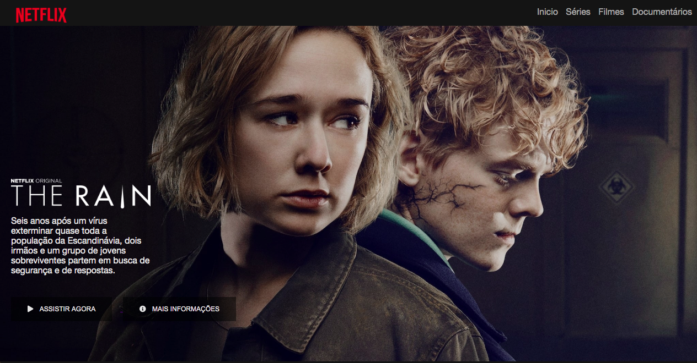

## Réplica Netflix

### Projeto 02 - Digital Innovation One 
#### Bootcamp FullStack Developer 

Recriar a interface do principal site de streaming mundial utilizando tecnologias simples como HTML5, CSS3 e JavaScript. 

##### Aprendizado sobre:

- Estruturar um layout.
- Técnicas de CSS3 com containers e variáveis.
- Posicionar os elementos com Flexbox.
- Utilizar plugins Jquery a favor da sua aplicação.

---------------------------------------------------------------------
criado por:

